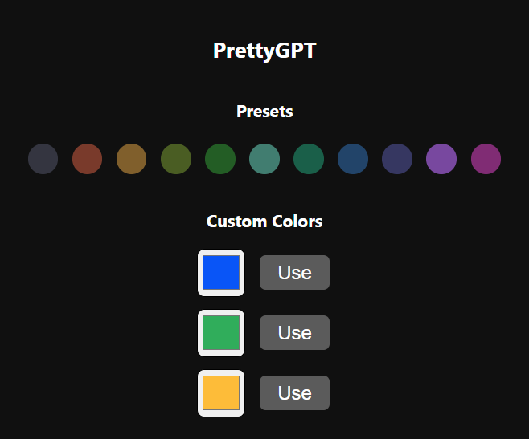
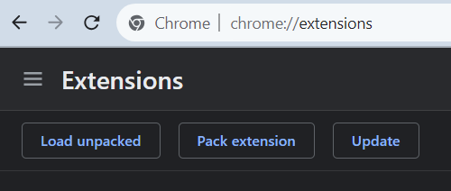
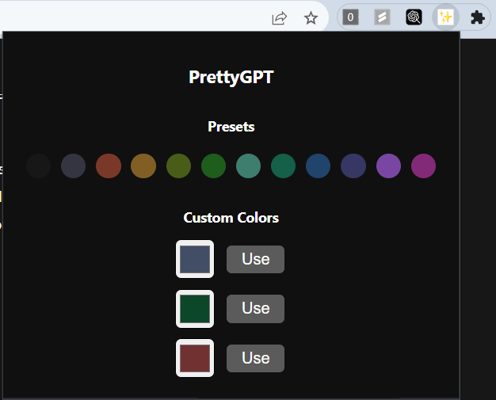

# Pretty GPT

## ChatGPT background color switcher



## How to setup

#### 1) Clone repo

```bash
git clone https://github.com/darakcheev00/gptcolorpicker
```

#### 2) Open Chrome extension manager
[chrome://extensions/](chrome://extensions/)

#### 3) Click "Load unpacked" and open the repo folder



#### 4) Open ChatGPT and select background color from extension popup
[https://chat.openai.com/](https://chat.openai.com/)



